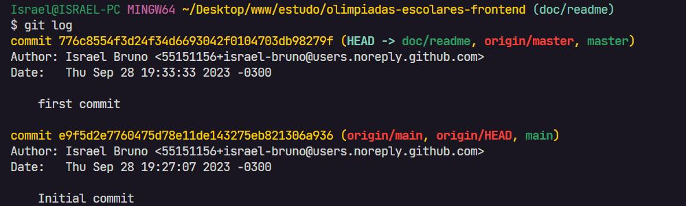
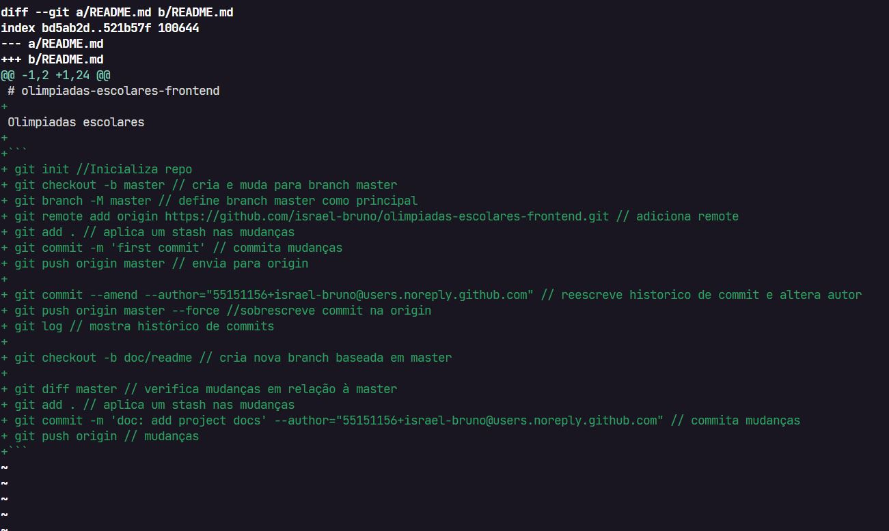

# olimpiadas-escolares-frontend

Olimpiadas escolares

- git init -> Inicializa repo
- git checkout -b master -> cria e muda para branch master
- git branch -M master -> define branch master como principal
- git remote add origin https://github.com/israel-bruno/olimpiadas-escolares-frontend.git -> adiciona remote
- git add . -> aplica um stash nas mudanças
- git commit -m 'first commit' -> commita mudanças
- git push origin master -> envia para origin
- git commit --amend --author="55151156+israel-bruno@users.noreply.github.com" -> reescreve historico de commit e altera autor
- git push origin master --force ->sobrescreve commit na origin
- git log -> mostra histórico de commits
  
- git checkout -b doc/readme -> cria nova branch baseada em master
- git diff master -> verifica mudanças em relação a master
  
- git add . -> aplica um stash nas mudanças
- git commit -m 'doc: add project docs' --author="55151156+israel-bruno@users.noreply.github.com" -> commita mudanças
- git push origin -> mudanças

### Diff no github

  

### Pull request

  

### Pull request merged

  
